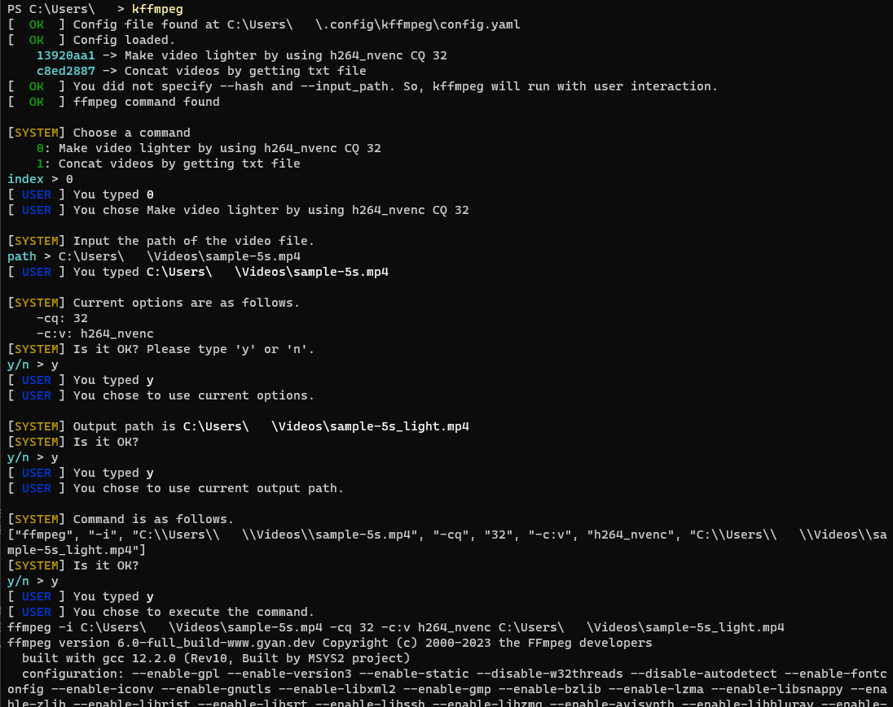

# k-ffmpeg
<p align="center">
  <b>I can't remember how to use ffmpeg! Ugh!</b>
</p>



[→日本語版](https://github.com/Kashiwade-music/kashiwade-ffmpeg-util-rust/blob/main/README_JPN.md)

## About
A handy tool for ffmpeg. Just type `kffmpeg` after pre-writing commands in a yaml file to execute ffmpeg interactively without the need to search for commands.

## Installation
### Windows/Linux/Mac
- Download the latest program from the Release page.
- Place the executable file in a suitable location and set up the path.

## Basic Usage
1. Open the terminal, run `kffmpeg` command. It creates an initial config file at `~/.config/kffmpeg` on first run, and the path is also output to the terminal.

    ```
    [  NG  ] Config file was not found. -> make at C:\Users\〇〇\.config\kffmpeg\config.yaml
    [  OK  ] Config loaded.
        13920aa1 -> Make video lighter by using h264_nvenc CQ 32
        c8ed2887 -> Concat videos by getting txt file
    [  OK  ] You did not specify --hash and --input_path. So, kffmpeg will run with user interaction.
    [  OK  ] ffmpeg command found
    ```

2. Open the configuration file in a text editor. It's written in YAML, and here are the item descriptions.

    ```yaml
    ffmpeg_path: /usr/bin/ffmpeg  # Set the path to the ffmpeg executable in case the ffmpeg command is not working.

    commands:
      - title: Make video lighter by using h264_nvenc CQ 32  # Brief description of the command.
        options:
          - flag: -cq  # Set the flag for the command option.
            value: 32  # Set the value for the command option.
          - flag: -c:v
            value: h264_nvenc
        output_extension: .mp4  # Set the output file extension.
        output_filename_suffix: _light  # Set the output file suffix. For example, if the input file name is input.mp4, the output file name will be input_light.mp4.
        command:
          - "{{ffmpeg_path}}"  # Input the actual command as an array. {{ffmpeg_path}} is a special command that will be replaced with the executable filename during execution. Required.
          - -i
          - "{{input_path}}"  # {{input_path}} is a special command that will be replaced with the input path. Required.
          - "{{options}}"  # {{options}} is a special command that will be replaced with the option parameters. Required.
          - "{{output_path}}"  # {{output_path}} is a special command that will be replaced with the output path. Required.
       ...

    ```

1. Save the config file, run `kffmpeg` in the terminal, and follow program messages to execute ffmpeg

## Non-interactive Usage
You can execute it without providing input by setting the `--hash` option and the `--input-path` option.

1. Open the terminal, run the `kffmpeg` command, and you should see the command title and an 8-character random hash below the line that says `Config loaded.`

    ```
    [  OK  ] Config file found at C:\Users\ryo\.config\kffmpeg\config.yaml
    [  OK  ] Config loaded.
        13920aa1 -> Make video lighter by using h264_nvenc CQ 32
        c8ed2887 -> Concat videos by getting txt file
    [  OK  ] You did not specify --hash and --input_path. So, kffmpeg will run with user    interaction.
    [  OK  ] ffmpeg command found
    ```

2. Exit k-ffmpeg using Ctrl+C or a similar command. Then, re-run k-ffmpeg with the desired command's hash value using `--hash` and the input file's path using `--input-path`. For instance, to apply the command `Make video lighter by using h264_nvenc CQ 32` to the file `C:\movie.mp4`, input the following in the terminal.

    ```sh
    kffmpeg --hash 13920aa1 --input-path "C:\movie.mp4"
    ```